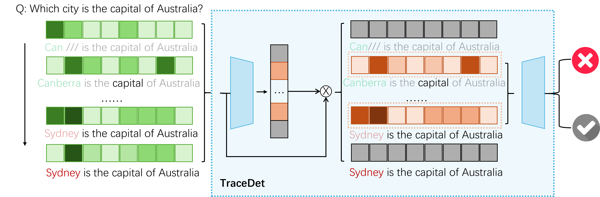

<p align="center">
  
</p>

<p align="center">
  <em>
  Figure 1: Overview of TraceDet. The framework detects hallucinations
  in D-LLMs via generation traces and entropy-based analysis.
  </em>
</p>


# TraceDet: Tracing Hallucination Detection in Large Language Models

This repository contains the implementation of **TraceDet**, a comprehensive framework for detecting and analyzing hallucinations in diffusion Large Language Models (D-LLMs) through generation trace and entropy-based analysis.


## Project Overview

TraceDet focuses on:
- **Evaluating factuality** on benchmarks like TriviaQA, hotpotQA and CommensenseQA
- **Training classifiers** to predict hallucination probability at different stages
- **Detecting hallucinations** in LLM generation through hidden state analysis

---

## Directory Structure

```
TraceDet_publish/
├── train_main.py                 # Main training script for TimeHalu model
├── train_lstm_baseline.py        # LSTM baseline implementation
├── train_transformer_baseline.py # Transformer baseline
├── train_tuning.py               # Hyperparameter tuning
├── step_entropy_ave.py           # Entropy analysis utility
│
├── models/                       # Model architectures
│   └── TimeHalu.py               # Core TimeHalu model implementation
│
├── trainers/                     # Training utilities
│   └── train_TimeHalu.py         # Training loop for TimeHalu
│
├── DLLM_generate/                # D-LLM generation
│   ├── dream_entropy.py          # Generation from Dream models
│   ├── data_loader.py            # Data loading utilities
│   ├── data_generator.py         # Synthetic data generation
│   ├── generate.py               # Generation pipeline
│   ├── generate_interoutput.py   # Intermediate output generation
│   └── metric_qwen.py            # Qwen model evaluation metrics
│
├── environment.yml               # Conda environment specification
├── run_data.sh                   # Data processing script
├── qwen_eval.sh                  # Qwen model evaluation script
├── tuning.sh                     # Tuning execution script
└── triviaqa_test_resultlist_mask.json  # TruthfulQA test results
```

---

## Setup & Installation

### Prerequisites
- Python 3.10

### Environment Setup

```bash
# Create conda environment
conda env create -f environment.yml
conda activate python310

```

---

## Reproducibility Pipeline

All experiments in the paper follow a **three-step pipeline**.

---

### Step 1: Generate LLM Outputs & Entropy Traces

Run LLM generation and extract token-level entropy and intermediate hidden states.

```bash
bash generate_data.sh
```
This step corresponds to entropy trace signal genration from D-LLMs in the paper.

---

### Step 2: Hallucination Annotation

Automatically label hallucinations using Qwen-based evaluation.

```bash
bash qwen_eval.sh
```

### Step 3: Train TimeHalu Detector

Train the temporal hallucination detection model.

```bash
python train_main.py \
```

This step corresponds to the main structure of TraceDet, following previous work of TimeX++ on the temporal infromation bottelneck modeling


---

## Citation

If you use TraceDet in your research, please cite:

```bibtex
@article{chang2025tracedet,
  title={TraceDet: Hallucination Detection from the Decoding Trace of Diffusion Large Language Models},
  author={Chang, Shenxu and Yu, Junchi and Wang, Weixing and Chen, Yongqiang and Yu, Jialin and Torr, Philip and Gu, Jindong},
  journal={arXiv preprint arXiv:2510.01274},
  year={2025}
}
```
---
## Acknowledgements

This project is inspired by and builds upon prior open-source research efforts.
We sincerely thank the authors and contributors of TimeX++ and LLaDa for making their codebases publicly available, which greatly facilitated the development of this work.

---

## License

This project is provided as-is for research purposes.

---

## Contact

For questions or collaborations, please reach out to the project maintainers. For bug reports and feature requests, please open an issue or contact the maintainers.
